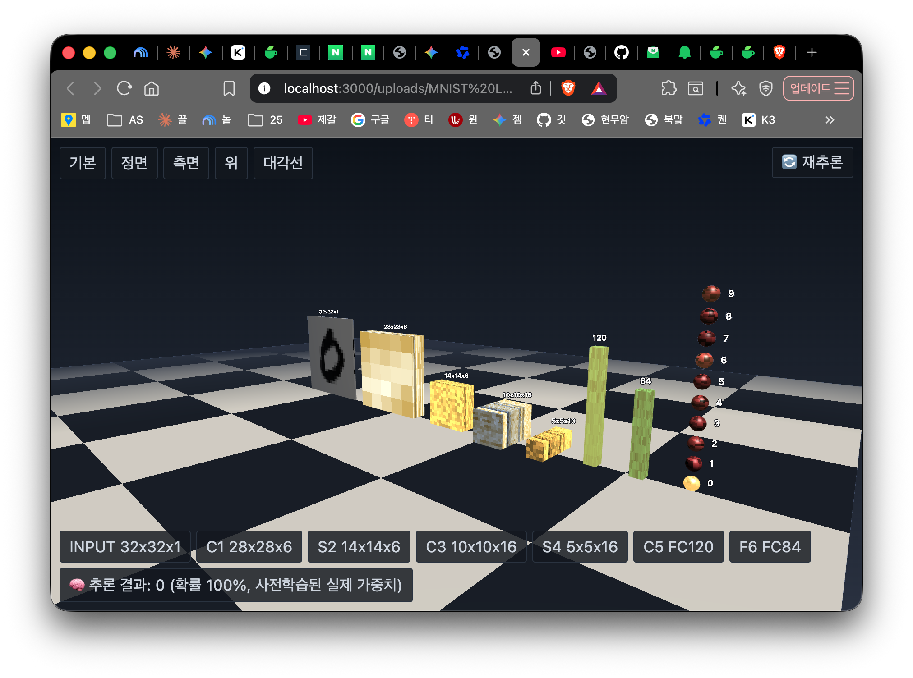
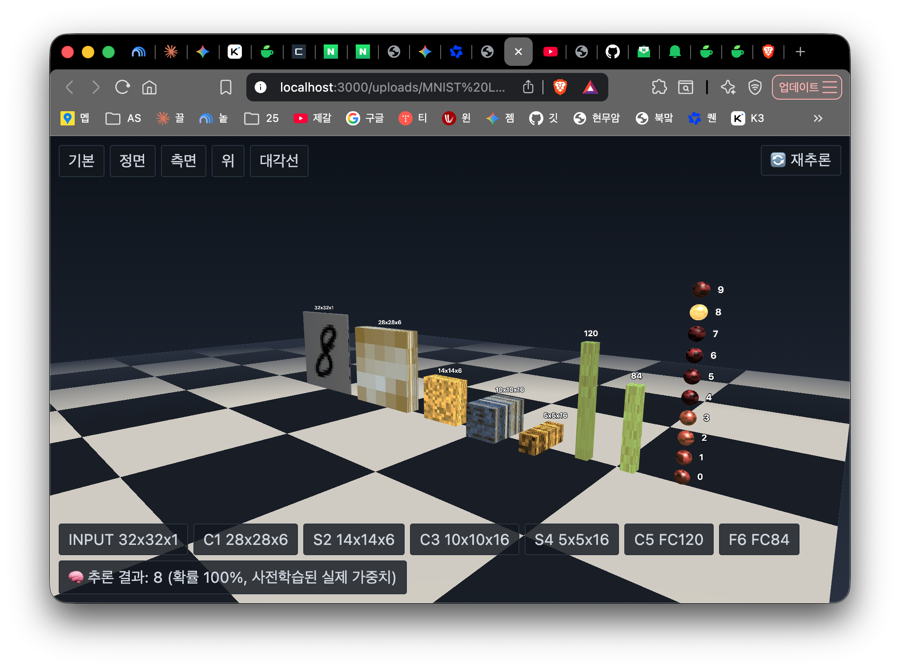
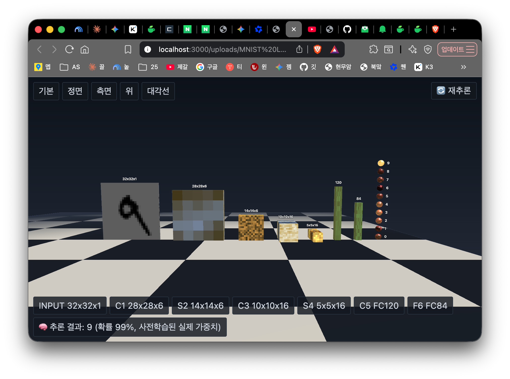
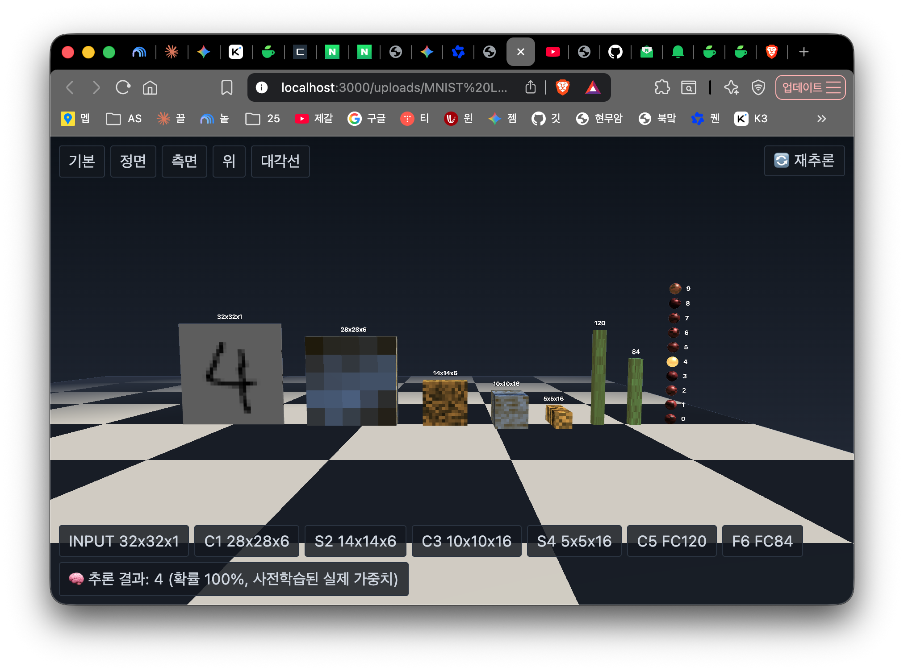
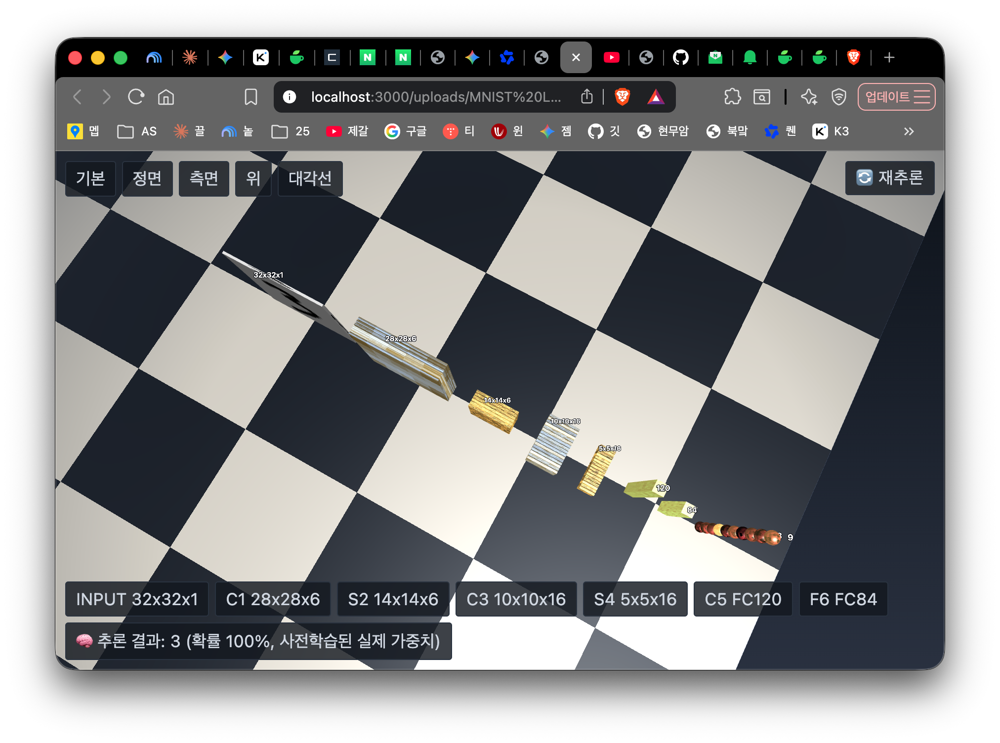
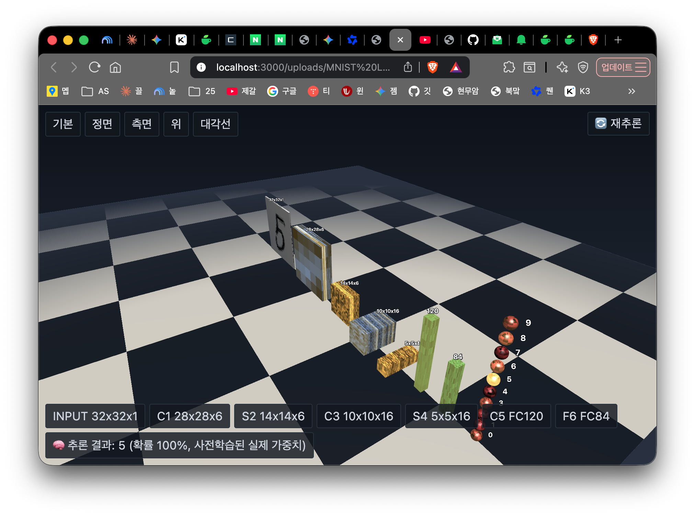

# VRML_JS_HTML_Python_Lenet5_3DWeb

**진짜로 학습된 LeNet-5 손글씨 숫자 인식 모델을 3D로 시각화하고, 브라우저에서 실시간으로 순전파(forward pass) 추론까지 계산하는 프로젝트입니다.**

Python(PyTorch)으로 실제 MNIST 데이터를 학습시킨 뒤, 그 가중치를 그대로 VRML97(.wrl)과 순수 JavaScript/WebGL 뷰어로 시각화합니다. 장식이나 애니메이션이 아니라, 화면에 보이는 그레이스케일 텍스처가 곧 신경망이 실제로 갖고 있는 가중치 숫자 그 자체이고, "재추론" 버튼을 누르면 그 가중치로 실제 합성곱·풀링·완전연결 연산을 브라우저 안에서 계산해서 결과를 보여줍니다.

## 스크린샷

실제 실행 화면입니다. 재추론 버튼을 누를 때마다 다른 MNIST 숫자가 랜덤으로 들어오고, 그때마다 각 레이어(채널)의 밝기와 예측 결과가 실제로 달라집니다.

| | |
|---|---|
|  |  |
|  |  |
|  |  |

다섯 번째 스크린샷(위 시점)에서 C1·S2·C3·S4 각 레이어가 채널 개수만큼 얇은 상자로 쪼개져 Z축으로 쌓여 있는 걸 옆에서 보듯 확인할 수 있습니다.

## 데모

```
scripts/build_scene.js 실행 후 output/lenet5-viewer.html을
로컬 웹 서버로 열면 바로 확인할 수 있습니다.
```

## 이게 뭘 보여주나요

- **입력**: 손글씨 숫자 이미지 (32×32, 흑백 1채널)
- **C1**: 5×5 합성곱, 6개 채널 → 각 채널이 독립된 3D 상자로 분리되어 표시
- **S2**: 2×2 평균 풀링, 6개 채널
- **C3**: 5×5 합성곱, 16개 채널 → 각 채널이 독립된 3D 상자로 분리되어 표시
- **S4**: 2×2 평균 풀링, 16개 채널
- **C5**: 완전연결 120개 뉴런 (입력이 정확히 5×5라 합성곱이 사실상 완전연결처럼 동작)
- **F6**: 완전연결 84개 뉴런
- **OUTPUT**: 0~9, 10개의 독립된 노드 (완전연결 84→10을 노드별로 쪼갬)

각 상자의 **크기(가로·세로)는 그 레이어의 실제 배열 크기**를, **두께(Z축)는 채널 수**를 그대로 축척 반영합니다.

## 핵심 특징

### 1. 진짜 학습된 가중치, 진짜 텍스처

레이어 표면에 보이는 그레이스케일 픽셀 무늬는 장식용 노이즈가 아니라 그 레이어(채널)가 실제로 학습한 가중치 값입니다. C1·C3의 각 채널 상자는 그 채널만의 진짜 5×5(C1) / 6×5×5(C3) 커널 가중치를 **텍셀 하나 = 가중치 하나**로 정확히 표시합니다. 텍스처 크기가 작아 보인다면, 그건 해상도를 줄인 게 아니라 5×5 합성곱 커널이 원래 가중치 25개짜리라 그렇습니다 (없는 데이터를 지어내지 않습니다).

### 2. 브라우저에서 실시간으로 도는 진짜 추론

`lib/vrml.js`의 WebGL 뷰어는 Three.js 같은 외부 라이브러리 없이, 순수 JavaScript로 다음을 전부 구현합니다:

- WebGL 렌더링 엔진 (박스/구체 메시, 카메라, 조명, 안개, 카메라 자동 프레이밍)
- 3D 공간에 항상 카메라를 향하는 텍스트 라벨(billboard)
- **conv2d, average pooling, fully-connected forward pass**를 순수 JS로 구현한 실제 추론 엔진

"🔄 재추론" 버튼을 누르면 MNIST 테스트셋(학습에 안 쓰인 이미지) 중 하나를 랜덤으로 골라 32×32로 변환하고, `conv1 → avgpool → conv2 → avgpool → fc(C5) → fc(F6) → output` 순서로 실제 순전파를 계산합니다. 예측된 숫자의 출력 노드가 밝게 빛나고, 각 레이어(채널)도 이번 입력에 실제로 얼마나 세게 반응했는지에 따라 서로 다른 밝기로 빛납니다 — 레이어 전체 평균이 아니라 채널 하나하나의 진짜 계산값입니다.

### 3. 5가지 시점 버튼 + 자유 회전

기본/정면/측면/위/대각선 5개의 고정 시점 버튼과 마우스 드래그로 자유롭게 회전·확대할 수 있습니다.

## 기술 스택

| 구성 요소 | 역할 |
|---|---|
| **Python + PyTorch** | 실제 MNIST 데이터로 LeNet-5 학습, 가중치 추출 |
| **VRML97 (.wrl)** | 레거시 3D 장면 포맷으로도 동일한 장면을 생성 (실제 VRML 브라우저용) |
| **JavaScript + WebGL** | 외부 라이브러리 없이 순수 JS로 구현한 3D 렌더링 + 실제 추론 엔진 |
| **HTML** | 텍스트 UI(버튼, 상태 표시)를 감싸는 자체완결형(self-contained) 뷰어 페이지 |

## 프로젝트 구조

```
lib/vrml.js                     # 재사용 가능한 VRML(.wrl) + WebGL 뷰어 생성 엔진 (의존성 없는 순수 Node 모듈)
scripts/train_lenet5.py         # 실제 MNIST로 LeNet-5 학습, data/lenet5_trained_weights.json 생성
scripts/export_mnist_samples.py # 재추론 버튼용 MNIST 테스트 이미지 40장 추출
scripts/build_scene.js          # 학습된 가중치로 실제 VRML/WebGL 장면을 생성
data/                           # 학습된 가중치, 샘플 이미지 메타데이터 (mnist_raw 원본 데이터는 gitignore)
output/                         # 생성된 결과물 (lenet5.wrl, lenet5-viewer.html, MNIST 샘플 이미지)
```

## 실행 방법

### 요구사항

- Node.js
- Python 3 + PyTorch + torchvision + Pillow

### 순서

```bash
# 1. 실제 MNIST 데이터로 LeNet-5 학습 (CPU로 5 epoch, 약 1분, 테스트 정확도 ~98%)
python3 scripts/train_lenet5.py

# 2. 재추론 버튼용 MNIST 테스트 이미지 40장 추출
python3 scripts/export_mnist_samples.py

# 3. 학습된 가중치로 3D 장면 생성
node scripts/build_scene.js

# 4. output/ 디렉토리를 로컬 웹 서버로 서빙 후 브라우저로 열기
#    (file:// 로 직접 열면 캔버스 보안 정책 때문에 텍스처 이미지 로딩이 막힙니다)
cd output && python3 -m http.server 8000
# 브라우저에서 http://localhost:8000/lenet5-viewer.html 접속
```

## 왜 만들었나

일반적인 신경망 시각화는 대부분 장식적인 애니메이션이거나, 학습되지 않은 무작위 가중치를 보여주는 데 그칩니다. 이 프로젝트는 **실제로 학습된 모델의 진짜 숫자**를 3D 그래픽으로 옮기고, 그 숫자로 **실제 연산까지** 브라우저에서 재현하는 것을 목표로 했습니다 — 신경망 내부에서 "지금 이 순간 무슨 계산이 일어나고 있는지"를 눈으로 확인할 수 있게 만든 것입니다.
